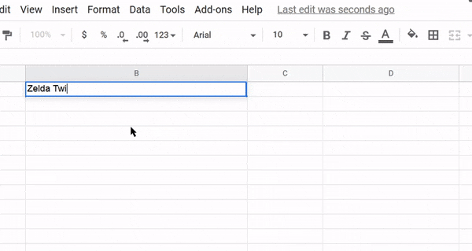

# SheetCoding

Autocompletes your sheet by consuming the IGDB API. Uses [Google Apps Script](https://www.google.com/script/start/) and it is fueled by [analysis paralysis](https://en.wikipedia.org/wiki/Overchoice).

# Example
